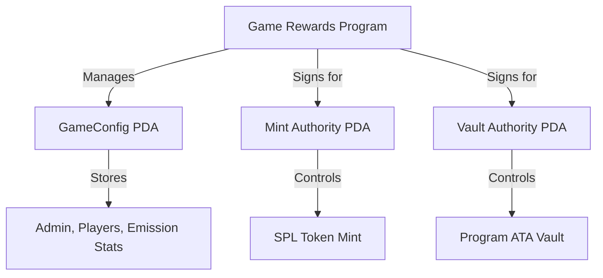
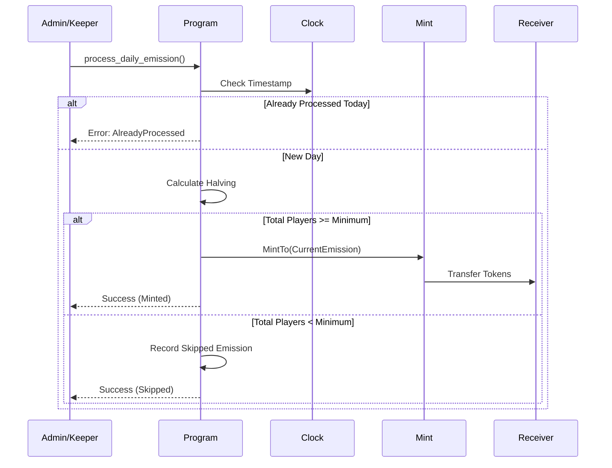

# 🎮 Solana Game Rewards System

[](https://www.anchor-lang.com/)
[](https://opensource.org/licenses/MIT)
[](https://solana.com/)

A professional, production-grade Solana smart contract designed for mobile game reward ecosystems. This program manages daily token emissions, halving cycles, and secure vault operations using the Anchor framework.

---

## 🚀 Overview

The **Game Rewards** program provides a robust on-chain economy for games. It automates token inflation through a daily emission model that rewards player growth while maintaining scarcity through scheduled halvings.

### Key Features
- **🛡️ PDA Governance**: All authorities (Mint & Vault) are Program Derived Addresses. No private keys required for on-chain operations.
- **📅 Daily Emission**: Secure logic to ensure tokens are minted exactly once per day by authorized keepers.
- **📉 Dynamic Halving**: Automated emission reduction based on configurable time intervals (e.g., every 365 days).
- **👥 Player-Gated Rewards**: Emissions are only distributed if the game meets a minimum player threshold; otherwise, the emission is "skipped" (virtual burn).
- **🔒 Admin Controls**: Granular control over player counts, reward receivers, and emergency pausing.

---

## 🏗️ Architecture

### Account Structure & PDAs
The program relies on three primary PDAs to ensure maximum security:



### Daily Emission Workflow


---

## 🛠️ Getting Started

### Prerequisites
- [Solana Tool Suite](https://docs.solana.com/cli/install-solana-cli-tools)
- [Anchor Version 0.32.1](https://www.anchor-lang.com/docs/installation)
- [Node.js & Yarn](https://nodejs.org/)

### Installation
```bash
git clone <your-repo-url>
cd game_rewards
yarn install
```

### Build & Test
```bash
# Build the program
anchor build

# Sync keys and rebuild
anchor keys sync
anchor build

# Run comprehensive tests
anchor test
```

---

## 📜 Instruction Set

### Admin Instructions
| Instruction | Description |
| :--- | :--- |
| `initialize_game_config` | Sets up the global state, mint, and emission rules. |
| `update_player_count` | Updates the current active player count (Oracle/Backend). |
| `update_min_players` | Changes the threshold for emission success. |
| `set_paused` | Emergency stop for emission and vault transfers. |
| `transfer_admin` | Securely migrates program authority to a new wallet. |
| `withdraw_tokens` | Transfers tokens from the program vault to a destination. |

### Public/Utility Instructions
| Instruction | Description |
| :--- | :--- |
| `process_daily_emission` | Triggers the daily minting logic (Callable by Admin/Keeper). |
| `deposit_tokens` | Allows users or the game to fund the program vault. |

---

## 🔒 Security Design

1.  **Checked Math**: Every arithmetic operation uses `checked_add`, `checked_div`, etc., to prevent overflows.
2.  **Access Control**: Critical functions use the `has_one = admin` constraint to ensure only authorized signers can modify state.
3.  **Validation**:
    *   `token_mint` is validated against the stored config address.
    *   `reward_receiver` must match the configured treasury.
    *   Vault transfers are signed using PDA seeds.
4.  **No Hardcoded Secrets**: All configuration is stored in accounts, making the program deployable across different environments (Devnet/Mainnet) without code changes.

---

## 📊 Tokenomics Logic

### Halving Formula
The daily emission $E$ is calculated as:
$$E_{current} = \frac{E_{base}}{2^{\lfloor \frac{DaysSinceLaunch}{Interval} \rfloor}}$$

If the player condition is not met:
- $TotalMinted$ remains unchanged.
- $TotalSkippedEmission$ increases by $E_{current}$.

---
